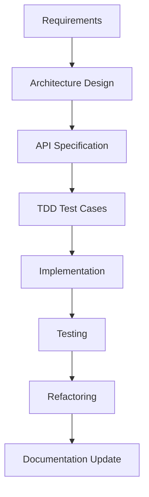

# HanoiGO – Social Map + PostGIS Backend Documentation

> Engineering documentation for the **Social Map + PostGIS** backend module of the HanoiGO project.
>
> **This repository contains technical documentation only. No production source code is stored here.**

---

# Overview

## About HanoiGO

HanoiGO is a travel-focused social application that enables users to discover places, participate in local activities, connect with travelers, manage trips, and explore food recommendations.

One of its core features is the **Social Map**, allowing users to discover nearby activities in real time based on geographic location.

---

## Social Map Module

The Social Map module is responsible for managing user-created activities and exposing location-aware APIs that allow nearby users to discover, join, and interact with these activities.

Core capabilities include:

- Creating activities
- Discovering nearby activities
- Joining activities
- Activity feeds
- Spatial querying using PostGIS

---

## Why PostGIS?

Traditional relational databases are inefficient for geographical proximity searches.

PostGIS extends PostgreSQL with spatial data types and indexing, allowing the backend to efficiently execute queries such as:

- Find activities within 2 km
- Calculate distance between user and activity
- Sort activities by proximity

Spatial queries are accelerated using **GiST indexes**, enabling scalable location-based services.

---

## Module Responsibilities

The Social Map backend is responsible for:

- Managing Activity resources
- Managing Activity participants
- Executing spatial queries
- Returning optimized activity feeds
- Applying business validation
- Exposing RESTful APIs
- Providing comprehensive backend testing

---

# Repository Structure

```text
.
├── README.md
├── architecture/
│   ├── social-map.md
│   ├── auth.md
│   └── media.md
├── api/
│   ├── activities.md
│   └── postman_collection.json
├── tdd/
│   ├── activity-create.md
│   ├── activity-feed.md
│   └── activity-join.md
├── diagrams/
│   ├── sequence.drawio
│   ├── erd.drawio
│   └── architecture.drawio
├── sql/
│   └── postgis.sql
└── docs/
    ├── implementation-plan.md
    └── changelog.md
```

---

## Directory Description

| Directory | Purpose |
|------------|---------|
| architecture | High-level system architecture and backend design |
| api | REST API specifications and Postman collection |
| tdd | Test-Driven Development specifications and test cases |
| diagrams | Draw.io diagrams including ERD, architecture, and sequence diagrams |
| sql | PostgreSQL/PostGIS scripts and optimization examples |
| docs | Development planning, implementation roadmap, and project history |

---

# Objectives

This repository exists to document the engineering design before implementation.

Primary objectives include:

- Document backend architecture
- Define API contracts
- Design business workflows
- Document PostgreSQL/PostGIS usage
- Describe database relationships
- Define testing strategy
- Support Test Driven Development
- Provide implementation planning
- Improve maintainability and onboarding

---

# Development Philosophy

The module follows a documentation-first development approach.

## Clean Architecture

The backend separates concerns into independent layers:

- Controller
- Service
- Data Access
- Database

Each layer has a single responsibility and can evolve independently.

---

## SOLID Principles

The implementation should follow:

- Single Responsibility Principle
- Open/Closed Principle
- Liskov Substitution Principle
- Interface Segregation Principle
- Dependency Inversion Principle

---

## RESTful API Design

Every endpoint should:

- Represent resources clearly
- Use proper HTTP methods
- Return meaningful status codes
- Be stateless
- Follow OpenAPI standards

---

## Test Driven Development (TDD)

Testing is written before implementation whenever possible.

Workflow:

1. Define requirements
2. Write failing tests
3. Implement minimal solution
4. Refactor
5. Repeat

This reduces regressions and improves code quality.

---

## Documentation-First Development

Implementation should begin only after:

- Architecture is reviewed
- API contracts are finalized
- Database design is approved
- Test cases are prepared

Documentation serves as the single source of truth throughout development.

---

# Documentation Index

| Document | Purpose | Status | Owner |
|----------|---------|--------|-------|
| README.md | Repository overview | Planned | Backend |
| architecture/social-map.md | Social Map architecture | Planned | Backend |
| architecture/auth.md | Authentication integration | Planned | Backend |
| architecture/media.md | Media upload architecture | Planned | Backend |
| api/activities.md | Activities API specification | Planned | Backend |
| api/postman_collection.json | API testing collection | Planned | Backend |
| tdd/activity-create.md | Create Activity TDD | Planned | Backend |
| tdd/activity-feed.md | Activity Feed TDD | Planned | Backend |
| tdd/activity-join.md | Join Activity TDD | Planned | Backend |
| sql/postgis.sql | PostGIS examples and optimization | Planned | Backend |
| docs/implementation-plan.md | Development roadmap | Planned | Backend |
| docs/changelog.md | Documentation history | Planned | Backend |

---

# Recommended Reading Order

New developers should follow this reading order:

1. README.md
2. architecture/social-map.md
3. architecture/auth.md
4. api/activities.md
5. sql/postgis.sql
6. tdd/activity-create.md
7. tdd/activity-feed.md
8. tdd/activity-join.md
9. implementation-plan.md

This sequence ensures developers understand the architecture before implementation and testing.

---

# Development Workflow

Development follows a documentation-first workflow.



Every implementation task should begin only after its architecture, API contract, and test cases have been documented.

---

# Coding Standards

## NestJS

- Feature-based module organization
- Thin Controllers
- Business logic in Services
- Dependency Injection
- Exception Filters where appropriate

---

## Prisma

- Use Prisma Client as the primary ORM
- Prefer transactions for multi-step operations
- Avoid raw SQL unless required
- Use raw SQL only for PostGIS-specific queries

---

## Folder Organization

Each feature module should contain:

```text
activities/

├── controller
├── service
├── dto
├── entity
├── mapper
└── tests
```

---

## DTO Naming

Examples:

- CreateActivityDto
- UpdateActivityDto
- ActivityFeedQueryDto

---

## Service Naming

Services should use verb-based methods.

Examples:

- createActivity()
- updateActivity()
- joinActivity()
- findNearbyActivities()

---

## Validation

Input validation should use:

- class-validator
- ValidationPipe
- DTO validation

Validation should occur before business logic execution.

---

## Error Handling

Use consistent HTTP status codes.

Examples:

| Status | Meaning |
|----------|---------|
| 400 | Bad Request |
| 401 | Unauthorized |
| 403 | Forbidden |
| 404 | Not Found |
| 409 | Conflict |
| 500 | Internal Server Error |

---

## Logging

Log only operational events.

Examples:

- Activity created
- Activity joined
- Failed validation
- Database errors

Sensitive information should never be logged.

---

# Testing Strategy

The project adopts a multi-layer testing strategy.

---

## Unit Tests

Focus on:

- Service methods
- Business rules
- Validation logic
- Helper functions

---

## Integration Tests

Verify interactions between:

- Controller
- Service
- Prisma
- PostgreSQL

---

## API Tests

Validate:

- Request payload
- Authentication
- Response format
- HTTP status codes

---

## PostGIS Tests

Verify:

- ST_DWithin behavior
- ST_Distance calculations
- Radius filtering
- Spatial indexing
- Query performance

---

## Edge Case Tests

Examples include:

- Empty datasets
- Invalid coordinates
- Large search radius
- Duplicate joins
- Maximum participant limits

---

## Security Tests

Cover:

- Authentication
- Authorization
- Invalid JWT
- SQL injection attempts
- Input validation
- Rate limiting

---

## Why TDD?

TDD provides several benefits:

- Clear acceptance criteria
- Early defect detection
- Safer refactoring
- Better API design
- Higher maintainability
- Improved developer confidence

---

# Definition of Done

A task is considered complete only when all of the following conditions are satisfied.

## Documentation

- [ ] Architecture updated
- [ ] API specification completed
- [ ] Database documentation updated
- [ ] Changelog updated

---

## Development

- [ ] Business requirements implemented
- [ ] REST API completed
- [ ] DTO validation implemented
- [ ] Error handling completed
- [ ] Logging added

---

## Database

- [ ] Prisma schema validated
- [ ] PostGIS queries optimized
- [ ] GiST indexes verified

---

## Testing

- [ ] Unit tests pass
- [ ] Integration tests pass
- [ ] API tests pass
- [ ] PostGIS tests pass
- [ ] Security tests completed

---

## Quality Assurance

- [ ] Swagger documentation updated
- [ ] Code reviewed
- [ ] No critical issues remain
- [ ] Ready for integration

---

# License

This repository is intended for internal engineering documentation of the HanoiGO project.

All documentation should remain synchronized with the production implementation throughout the software development lifecycle.
